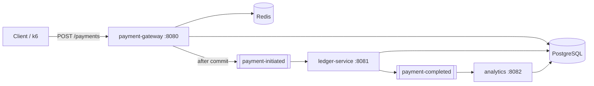

# SwiftPay — Real-Time P2P Payment Ledger

Event-driven P2P payments on **Java 21 / Spring Boot 3**: the gateway accepts transfers (**202**), settlement runs async over **Kafka**, and **PostgreSQL** is the ledger of record. **Redis** handles idempotency and balance cache on the hot path.

**Repo:** [github.com/Raghav-byte/Swift-pay](https://github.com/Raghav-byte/Swift-pay) · **License:** [Non-Commercial](LICENSE)

---

## Architecture



Gateway validates idempotency + balance, writes `PENDING`, publishes `payment-initiated`. Ledger locks accounts, debits/credits, emits `payment-completed`. Analytics worker aggregates events.

Load-tested at **~250 RPS / ~1M requests** — see [docs/PERFORMANCE.md](docs/PERFORMANCE.md).

Full design: [docs/SWIFTPAY_ARCHITECTURE.md](docs/SWIFTPAY_ARCHITECTURE.md)

---

## Quick start

**Prerequisites:** Java 21, Docker, Postgres (Supabase or local).

1. Create `.env` at the repo root:

```env
DB_URL=jdbc:postgresql://<pooler-host>:6543/postgres
DB_USERNAME=postgres.<project-ref>
DB_PASSWORD=<your-password>
REDIS_HOST=localhost
REDIS_PORT=6379
KAFKA_BOOTSTRAP=localhost:9092
```

2. Apply schema + seed — [docs/SWIFTPAY_ARCHITECTURE.md §3](docs/SWIFTPAY_ARCHITECTURE.md), [docs/seed.sql](docs/seed.sql).

3. Start the stack:

```bash
docker compose up -d --build
```

Compose reads `DB_*` from `.env`. For offline Postgres: `docker compose --profile local-db up -d` and point `.env` at `jdbc:postgresql://postgres:5432/swiftpay`.

4. Or run services on the host (after `docker compose up -d redis kafka zookeeper`):

```bash
cd payment-gateway && ./mvnw spring-boot:run
cd ledger-service  && ./mvnw spring-boot:run
cd analytics       && ./mvnw spring-boot:run
```

5. Try a payment:

```bash
curl -X POST http://localhost:8080/v1/payments \
  -H "Content-Type: application/json" \
  -d '{"transactionId":"aaaaaaaa-0000-0000-0000-000000000001",
       "senderId":"b0000001-0000-0000-0000-000000000001",
       "receiverId":"b0000002-0000-0000-0000-000000000002",
       "amount":100.00,"currency":"INR"}'
```

**Swagger:** `:8080`, `:8081`, `:8082` → `/swagger-ui.html`

**Load test:** `docker compose --profile loadtest run --rm k6 run /scripts/payment-load-test-smoke.js`

---

## Docs

| Doc | Topic |
|-----|-------|
| [SWIFTPAY_ARCHITECTURE.md](docs/SWIFTPAY_ARCHITECTURE.md) | Flows, schema, Redis/Kafka, APIs |
| [PERFORMANCE.md](docs/PERFORMANCE.md) | k6 results |
| [ARCHITECTURE_AND_OPTIMIZATION.md](docs/ARCHITECTURE_AND_OPTIMIZATION.md) | Tuning notes |
| [k8s/README.md](k8s/README.md) | Kubernetes deploy |

---

Copyright © 2026 Raghav. See [LICENSE](LICENSE) for terms.
